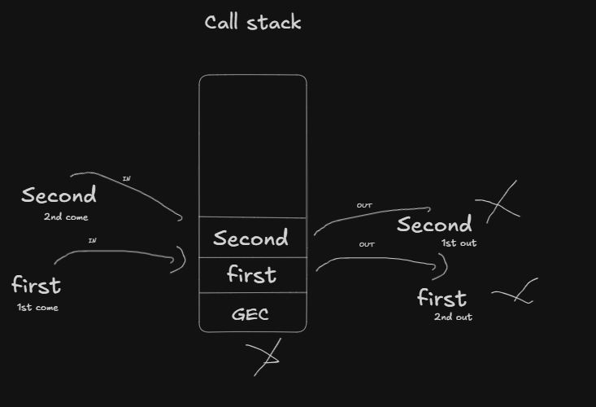
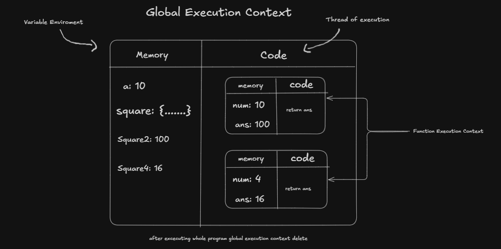
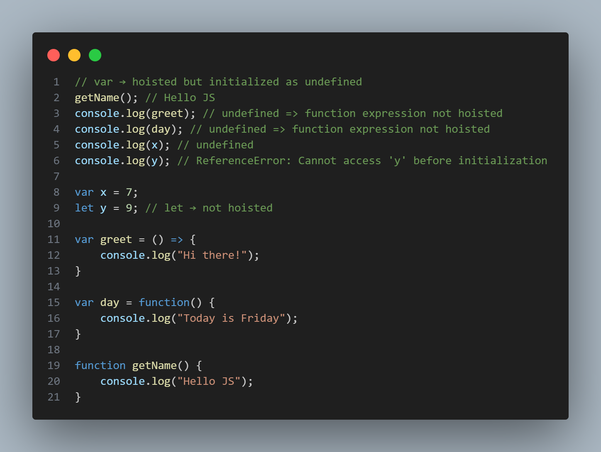

# javaScript_Interview_questions
A concise explanation of JavaScript Call Stack and Execution Context concepts with visual aids and example files.

**Assets**: Add two images to `Assets/` so the visuals render in this README:
- `Assets/call_stack.png` — visual of the call stack behavior
- `Assets/global_execution_context.png` — visual of the global execution context and function execution contexts

**How to view examples**:
- Run the examples with Node.js: `node Execution_Context.js` or `node Call_Stack.js` (files are in the repo root).
- See the example source files: [Execution_Context.js](Execution_Context.js), [Call_Stack.js](Call_Stack.js)

**Call Stack**


- **What it is**: The Call Stack is a LIFO (last-in, first-out) data structure that the JavaScript runtime uses to keep track of function execution. Each time a function is called, a new frame (execution context) is pushed onto the stack; when the function returns, its frame is popped.
- **Key points**: Functions called later are resolved first (they return, then earlier callers resume). Synchronous code uses the call stack; long-running synchronous tasks block the stack.
- **Example (conceptual)**: If `first()` calls `second()`, the stack will have `GEC` → `first` → `second`. When `second` returns, it's popped, then `first` finishes and is popped.

**Global Execution Context (GEC) & Function Execution Contexts (FECs)**


- **GEC**: Created when the program starts. It contains the global variable environment (variables, function declarations) and the code/thread of execution.
- **FEC**: Each function call creates its own execution context with its own memory (local variables, parameters) and a pointer to the function code.
- **Lifecycle**: GEC is created first. Each function call creates a new FEC which is pushed to the call stack. On return, the FEC is removed. When the program exits, the GEC is cleaned up by the runtime.

**Walkthrough using `Execution_Context.js`**
- `var a = 10;` — stored in GEC memory as `a: 10`.
- `function square(num) { var ans = num * num; return ans; }` — the function `square` is stored in GEC (its code and identifier).
- `var square2 = square(a);` — calling `square` creates an FEC where `num` is `10`, `ans` becomes `100`. The FEC returns `100` and is popped; `square2` in GEC becomes `100`.
- Next `var square4 = square(4);` — similar process: new FEC, `num: 4`, `ans: 16`, return `16`, pop FEC, store in `square4`.

**Hoisting**


- **What hoisting means**: Declarations using `var` and function declarations are processed during the creation phase of the execution context — their names are added to memory before code runs. `var` variables are hoisted but initialized to `undefined`. `let` and `const` are not accessible before initialization (they are in the temporal dead zone). Function declarations are hoisted with their full definitions; function expressions assigned to variables follow variable hoisting rules.
- **Key behaviors in `Hoisting.js`**:
	- `getName();` works because `getName` is a function declaration and is hoisted with its body.
	- `console.log(greet);` prints `undefined` because `greet` is a `var` variable; the variable name is hoisted but the arrow function assignment runs later.
	- `console.log(day);` prints `undefined` for the same reason — the `var` binding exists but the function expression is not assigned yet.
	- `console.log(x);` prints `undefined` (hoisted `var x`).
	- `console.log(y);` throws `ReferenceError` because `y` is declared with `let` and is in the temporal dead zone until its declaration is executed.

**Try it**
- Run the hoisting example with Node.js:

```bash
node Hoisting.js
```

You should observe the outputs and the `ReferenceError` explained above.

**Notes & Next Steps**
- If the images do not appear, add the PNG files into the `Assets/` folder as `call_stack.png` and `global_execution_context.png`.
- Want me to add the image files into `Assets/` now? I can place them if you provide the image files or allow me to embed the provided attachments into the repo.

---
_Compact explanation prepared for interview review and teaching; drop-in visuals help make the concepts concrete._
