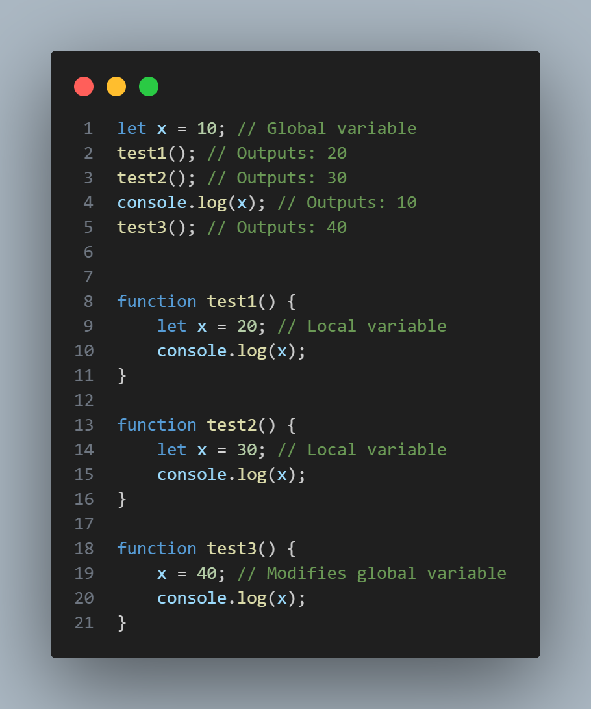

# 🟡 JavaScript Interview Questions

A comprehensive collection of JavaScript concepts explained with code examples, visual aids, and interview-ready notes.

> **Run any example** with Node.js:
> ```bash
> node <filename>.js
> ```

---

## 📑 Table of Contents

| # | Concept | Source File |
|---|---------|-------------|
| 1 | [Call Stack](#1--call-stack) | [Call_Stack.js](Call_Stack.js) |
| 2 | [Execution Context (GEC & FEC)](#2--global-execution-context-gec--function-execution-contexts-fecs) | [Execution_Context.js](Execution_Context.js) |
| 3 | [Hoisting](#3--hoisting) | [Hoisting.js](Hoisting.js) |
| 4 | [Undefined vs Not Defined](#4--undefined-vs-not-defined) | [Undefine_vs_not_define.js](Undefine_vs_not_define.js) |
| 5 | [Block Scope](#5--block-scope) | [Block_scope.js](Block_scope.js) |
| 6 | [Function Scope & Globals](#6--function-scope--globals) | [Function_Work.js](Function_Work.js) |
| 7 | [Lexical Scope](#7--lexical-scope) | [Lexical_scope.js](Lexical_scope.js) |
| 8 | [Closures](#8--closures) | [Closure.js](Closure.js) |
| 9 | [Currying](#9--currying) | [Currying.js](Currying.js) |
| 10 | [IIFE](#10--iife-immediately-invoked-function-expression) | [IIFE.JS](IIFE.JS) |
| 11 | [Map Method](#11--map-method) | [Map_method.js](Map_method.js) |
| 12 | [Promises](#12--promises) | [Promises.js](Promises.js) |
| 13 | [Async / Await](#13--async--await) | [Async_Await.js](Async_Await.js) |
| 14 | [setTimeout & setInterval](#14--settimeout--setinterval) | [Timeout.js](Timeout.js) |
| 15 | [Event Bubbling & Capturing](#15--event-bubbling--capturing) | [Event_capturing&bubbling.js](Event_capturing&bubbling.js) |
| 16 | [Event Delegation](#16--event-delegation) | [Event_Delegation.js](Event_Delegation.js) |

---

## 1 — Call Stack


- **What it is**: A **LIFO** (last-in, first-out) data structure the JS runtime uses to track function execution. Each call pushes a new frame; each return pops it.
- **Key points**: Functions called later are resolved first. Synchronous code uses the call stack — long-running tasks **block** it.
- **Conceptual example**: `first()` calls `second()` → stack is `GEC → first → second`. When `second` returns it's popped, then `first` finishes.

📄 **Source**: [Call_Stack.js](Call_Stack.js)

---

## 2 — Global Execution Context (GEC) & Function Execution Contexts (FECs)


- **GEC**: Created when the program starts. Contains the global variable environment (variables, function declarations) and the thread of execution.
- **FEC**: Each function call creates its own execution context with its own memory (local variables, parameters).
- **Lifecycle**: GEC is created first → each function call creates a new FEC pushed to the call stack → on return the FEC is removed → when the program exits the GEC is cleaned up.

**Walkthrough** (`Execution_Context.js`):

```
var a = 10;           → stored in GEC memory as a: 10
square(a)             → new FEC: num=10, ans=100, returns 100, popped
square(4)             → new FEC: num=4,  ans=16,  returns 16,  popped
```

📄 **Source**: [Execution_Context.js](Execution_Context.js)

---

## 3 — Hoisting


- `var` declarations are hoisted and initialized to `undefined`.
- `let` / `const` are hoisted but remain in the **Temporal Dead Zone** (TDZ) until their declaration line — accessing them before that throws a `ReferenceError`.
- **Function declarations** are hoisted with their full body; **function expressions** follow variable hoisting rules.

**Key behaviors in** `Hoisting.js`:

| Statement | Output | Why |
|-----------|--------|-----|
| `getName()` | Works ✅ | Function declaration — hoisted with body |
| `console.log(greet)` | `undefined` | `var` hoisted, arrow fn not yet assigned |
| `console.log(day)` | `undefined` | `var` hoisted, function expr not assigned |
| `console.log(x)` | `undefined` | Hoisted `var x` |
| `console.log(y)` | `ReferenceError` ❌ | `let y` is in the TDZ |

```bash
node Hoisting.js
```

📄 **Source**: [Hoisting.js](Hoisting.js)

---

## 4 — Undefined vs Not Defined

> These two are **not** the same thing!

| Term | Meaning |
|------|---------|
| `undefined` | Variable is **declared** but has no value assigned yet (or it was hoisted as `var`) |
| `not defined` | Variable was **never declared** — accessing it throws a `ReferenceError` |

```js
console.log(a); // undefined  (var a is hoisted)
console.log(b); // ReferenceError: b is not defined

var a = 10;
var c;

console.log(a); // 10
console.log(c); // undefined (declared but never assigned)
```

```bash
node Undefine_vs_not_define.js
```

📄 **Source**: [Undefine_vs_not_define.js](Undefine_vs_not_define.js)

---

## 5 — Block Scope

- `let` and `const` are **block-scoped** — they only exist inside the `{ }` block where they're declared.
- `var` is **function-scoped** (or global) — a `var` inside a block **overwrites** the outer variable.

```js
var a = 10;
let b = 30;

{
    var a = 20;    // ⚠️ overwrites global a
    let b = 70;    // separate block-scoped b
    const c = 40;  // block-scoped
    console.log(a); // 20
    console.log(b); // 70
    console.log(c); // 40
}

console.log(a); // 20  (mutated by var inside block)
console.log(b); // 30  (block let didn't affect outer b)
// console.log(c); → ReferenceError (c doesn't exist here)
```

```bash
node Block_scope.js
```

📄 **Source**: [Block_scope.js](Block_scope.js)

---

## 6 — Function Scope & Globals



- Functions create their own **local scope**. Variables declared with `let` or `var` inside a function are local.
- Assigning to a variable without declaring it locally **updates the outer / global** variable.

**Walkthrough** (`Function_Work.js`):

| Step | Output | Why |
|------|--------|-----|
| `test1()` | `20` | Local `let x = 20` |
| `test2()` | `30` | Local `let x = 30` |
| `console.log(x)` | `10` | Global `x` unchanged |
| `test3()` | `40` | `x = 40` without `let` → mutates global `x` |

```bash
node Function_Work.js
```

📄 **Source**: [Function_Work.js](Function_Work.js)

---

## 7 — Lexical Scope

- **Lexical scope** means a function's scope is determined by **where it is written**, not where it is called.
- Inner functions have access to variables declared in their **outer (enclosing) functions** — this creates a **scope chain**.

```js
function a() {
    var b = 10;
    c();
    function c() {
        d();
        function d() {
            console.log(b); // 10 — accessed via scope chain
        }
    }
}
a();
```

> `d()` can access `b` because it walks up the scope chain: `d → c → a` and finds `b` in `a`'s scope.

```bash
node Lexical_scope.js
```

📄 **Source**: [Lexical_scope.js](Lexical_scope.js)

---

## 8 — Closures

- A **closure** is a function that **remembers** the variables from its outer scope even after the outer function has returned.
- Closures don't remember *values* — they remember *variable references* (the variable stays alive).

```js
function counter() {
    let count = 0;
    return {
        increment: function () { count++; return count; },
        decrement: function () { count--; return count; },
        getCount:  function () { return count; }
    };
}

const c = counter();
c.getCount();   // 0
c.increment();  // 1
c.increment();  // 2
c.decrement();  // 1
c.getCount();   // 1
```

**Why use closures?**
1. **Data Privacy** — hide variables from the outside world
2. **Function Factories** — create specialized functions
3. **Memoization** — cache expensive computations
4. **Event Handlers** — maintain state across callbacks
5. **Currying** — transform multi-argument functions

```bash
node Closure.js
```

📄 **Source**: [Closure.js](Closure.js)

---

## 9 — Currying

- **Currying** transforms a function that takes multiple arguments into a **sequence of functions** each taking a single argument.

```js
// Curried
function add(a) {
    return function (b) {
        return function (c) {
            return a + b + c;
        };
    };
}
add(2)(2)(9); // 13

// Non-curried equivalent
function add(a, b, c) {
    return a + b + c;
}
add(2, 2, 9); // 13
```

**Why use currying?**
1. **Partial Application** — fix some arguments and return a reusable function
2. **Function Composition** — chain functions together easily
3. **Memoization** — cache intermediate results

```bash
node Currying.js
```

📄 **Source**: [Currying.js](Currying.js)

---

## 10 — IIFE (Immediately Invoked Function Expression)

- An **IIFE** is a function that runs **immediately** after it is defined.
- Used to create a **private scope** and avoid polluting the global namespace.

```js
// Normal function — must be called separately
function greet() {
    console.log("Namaste");
}
greet();

// IIFE — defines and calls in one step
(function () {
    console.log("Hello World");
})();
```

```bash
node IIFE.JS
```

📄 **Source**: [IIFE.JS](IIFE.JS)

---

## 11 — Map Method

- `Array.prototype.map()` creates a **new array** by applying a function to every element of the original array.
- It does **not** modify the original array (immutable operation).

```js
const number = [1, 2, 3, 4, 5];
const double = number.map(num => num * 2);

console.log(double); // [2, 4, 6, 8, 10]
console.log(number); // [1, 2, 3, 4, 5]  ← unchanged
```

**Why use `map`?**
- More concise and readable than a `for` loop
- Functional programming approach
- Does **not** mutate the original array

```bash
node Map_method.js
```

📄 **Source**: [Map_method.js](Map_method.js)

---

## 12 — Promises

- A **Promise** is an object representing the **eventual completion or failure** of an asynchronous operation.
- Three states: **pending** → **fulfilled** (resolved) or **rejected**.

```js
function fetchData() {
    return new Promise((resolve, reject) => {
        setTimeout(() => {
            resolve("Data loaded!");
        }, 2000);
    });
}

fetchData()
    .then((data) => console.log("Success:", data))
    .catch((error) => console.log("Error:", error));
```

**Key methods**: `.then()` for success, `.catch()` for errors, `.finally()` for cleanup.

```bash
node Promises.js
```

📄 **Source**: [Promises.js](Promises.js)

---

## 13 — Async / Await

- `async/await` is **syntactic sugar** over Promises — it lets you write asynchronous code that **looks** synchronous.
- `async` marks a function as asynchronous; `await` pauses execution until the Promise resolves.
- Error handling uses `try / catch` instead of `.catch()`.

```js
async function fetchData() {
    try {
        const response = await fetch('https://jsonplaceholder.typicode.com/todos/2');
        const data = await response.json();
        console.log("Data fetched successfully", data);
    } catch (error) {
        console.log("Error:", error);
    }
}

fetchData();
```

```bash
node Async_Await.js
```

📄 **Source**: [Async_Await.js](Async_Await.js)

---

## 14 — setTimeout & setInterval

| Function | Purpose |
|----------|---------|
| `setTimeout(fn, ms)` | Execute `fn` **once** after `ms` milliseconds |
| `setInterval(fn, ms)` | Execute `fn` **repeatedly** every `ms` milliseconds |
| `clearTimeout(id)` | Cancel a pending `setTimeout` |
| `clearInterval(id)` | Cancel a running `setInterval` |

```js
const timeId = setTimeout(() => {
    console.log("Runs once after 1s");
}, 1000);

const intervalId = setInterval(() => {
    console.log("Runs every 1s");
}, 1000);

clearTimeout(timeId);      // cancel the timeout
clearInterval(intervalId);  // cancel the interval
```

> Both callbacks are placed in the **Task Queue** (macrotask queue) and execute only when the call stack is empty.

```bash
node Timeout.js
```

📄 **Source**: [Timeout.js](Timeout.js)

---

## 15 — Event Bubbling & Capturing

Events in the DOM propagate in **two phases**:

| Phase | Direction | Description |
|-------|-----------|-------------|
| **Capturing** (trickling) | Outer → Inner | Event travels from the root down to the target element |
| **Bubbling** | Inner → Outer | Event travels from the target element back up to the root |

> By default, event listeners fire during the **bubbling** phase. Pass `{ capture: true }` (or `true` as the third argument to `addEventListener`) to listen during the capturing phase.

📄 **Source**: [Event_capturing&bubbling.js](Event_capturing&bubbling.js)

---

## 16 — Event Delegation

- Instead of attaching listeners to **every child** element, attach a **single listener** to a common **parent**.
- The parent uses `event.target` to determine which child was actually clicked.
- **Benefits**: fewer event listeners, works for dynamically added children, better performance.

```js
// Instead of adding click handler to every <li>:
document.querySelector("ul").addEventListener("click", (e) => {
    if (e.target.tagName === "LI") {
        console.log("Clicked:", e.target.textContent);
    }
});
```

📄 **Source**: [Event_Delegation.js](Event_Delegation.js)

---

## 📚 Full Syllabus

See [Syllabus.txt](Syllabus.txt) for the complete interview preparation roadmap covering:

1. JavaScript Fundamentals
2. Core JS Concepts (Execution Context, Hoisting, Scope, Closures, `this`)
3. Objects & Arrays (Methods, Destructuring, Spread/Rest)
4. Asynchronous JavaScript (Callbacks, Promises, Async/Await, Event Loop)
5. Advanced Concepts (Prototypes, Classes, Currying, Higher-Order Functions)
6. JS Internals (Single-threaded, Modules, Strict Mode)
7. Browser & Environment (DOM, Events, Web Storage, Networking)
8. Error Handling & Debugging
9. Performance & Optimization (Debouncing, Throttling, Lazy Loading)
10. Real-World Interview Twist Questions

---

## 🗂️ Project Structure

```
javaScript_Interview_questions/
├── Assets/                          # Images & visual aids
├── Async_Await.js                   # Async/Await
├── Block_scope.js                   # Block Scope (let, const, var)
├── Call_Stack.js                    # Call Stack
├── Closure.js                       # Closures
├── Currying.js                      # Function Currying
├── Event_capturing&bubbling.js      # Event Phases
├── Event_Delegation.js              # Event Delegation
├── Execution_Context.js             # Execution Context
├── Function_Work.js                 # Function Scope & Globals
├── Hoisting.js                      # Hoisting & TDZ
├── IIFE.JS                         # IIFE
├── Lexical_scope.js                 # Lexical Scope & Scope Chain
├── Map_method.js                    # Array Map
├── Promises.js                      # Promises
├── Syllabus.txt                     # Full Interview Syllabus
├── Timeout.js                       # setTimeout & setInterval
├── Undefine_vs_not_define.js        # undefined vs not defined
└── README.md                        # ← You are here
```

---

_📝 Compact explanations prepared for interview review and teaching. Add PNG files to the `Assets/` folder to enable embedded visuals._
